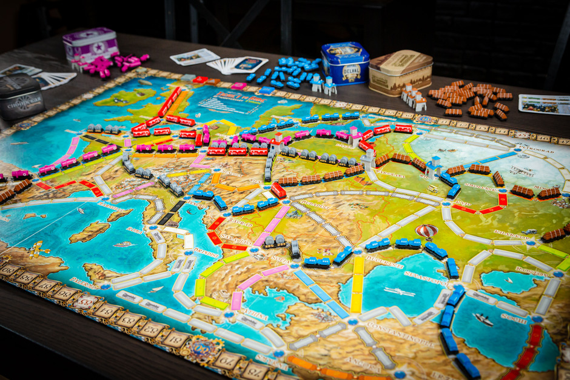

<head>
<link rel="stylesheet" href="https://cdn.jsdelivr.net/npm/katex@0.10.2/dist/katex.min.css" integrity="sha384-yFRtMMDnQtDRO8rLpMIKrtPCD5jdktao2TV19YiZYWMDkUR5GQZR/NOVTdquEx1j" crossorigin="anonymous">

</head>

# Modelling Ticket to Ride

_Authors: Sverre Brok, Lennard Froma and Jeroen van Gelder_

## Introduction

Ticket to Ride is a popular board game (_see Fig. 1_) designed by Alan R. Moon and published by Days of Wonder. 
The game's end goal is to build a railway network that yields the highest points. 
There are various versions of the game with different maps of parts of the world. 
On these maps, locations/cities are marked as nodes, representing possible locations for a train station. 
These nodes are connected with railway connections, which a player can claim in their turn. 
The length of the connection determines the score a player receives for that part of the railway. 
At the start of the game, each player is given the same number of unique target routes, which yield additional points upon completion.
Failing to complete one or more routes will cause points to be subtracted at the end of the game.

This project's research goal is to simulate and model knowledge within (a simplification of) Ticket to Ride. 
The implementation should visualize the knowledge using a Kripke model and use the acquired knowledge to determine what the following action a player should take (within some given constraints). 
The knowledge is acquired by observing other players, the board and their cards.

## The original game Ticket to Ride
The game consists of different cards and objects for which the meaning and function will be explained in this section.
With this game, players should obtain as many points as possible. This is done by finishing route cards that are worth points.
A **route card** contains two cities between which the player will have to create a route. A route is constructed by claiming connections 
by placing enough trains. A route card is completed when there is a route of adjoining connections owned by the player between
the two cities on the route card. When the route is finished, the player obtains the number of points as indicated by the route card. 
To place trains on a connection (i.e. claim a connection), a player can draw coloured **train cards**. The connections have different 
colours indicating which coloured train card is needed to claim that specific connection. The length of the connection indicates
how many train cards of a particular colour are needed. Furthermore, there are multiple **joker cards** in the game that can 
be used as any of the colours.

In the original game, there are three different kinds of connections. Regular connections between cities, ferry connections,
and tunnel connections. For claiming a regular connection, a player must have several train cards of a particular colour. 
The number of train cards that are needed to claim a connection corresponds to the length of the connection.
The ferry connection requires regular train cards combined with a minimum number of jokers,
indicated as locomotive icons on the connection. The tunnel connection is a bit more complex. For example, for a tunnel of length two and
colour green, a player would have to draw three new cards from the deck (this number does not depend on the length of the tunnel connection).
Then, the number of cards that match, in this case, the colour green will have to be added by the player. 

Another option for a player to complete a route is to place a train station on a city. 
This train station can then be used at the end of the game to use a connection owned by another player that adjoins the corresponding city.

In the original game, a player has four options at each turn. 
1) First, the player can opt to gather train cards which allow them to a claim connection in a consequent turn.
Train cards can be drawn from a deck. The deck consists of an open pile (5 train cards that are visible to everyone) and a closed pile.
A player may draw 2 cards from the open or closed pile (or a combination thereof), or only one joker card from the open pile.
2) Another possibility for a player is to claim a specific connection.
This is done by playing the number of train cards of the length of the specific connection, all with that connection's colour. 
Only one route can be claimed during a player's turn.
3) Additionally, a player can build a train station to utilize a route that has already been claimed by another player. 
4) Lastly, a player can obtain new route cards from a selection of the remaining route cards. 

The game ends when one player has 2 trains left. Then every player does one extra turn and after that, the points 
will be counted. Route cards that are not completed will give a penalty by subtracting the points the route is worth
from the total.

## Simplifications of the game

In order for us to achieve a feasible implementation of Ticket to Ride with knowledge, some simplifications had to be
made. These simplifications both address the scale of the game, and the removal of possible uncertainties when considering
knowledge of the agents.

Firstly, the number of cities is reduced from the original 47 cities to a more reasonable 24. With this reduction of
cities, this automatically reduces the number of connections as well. As mentioned, the regular game has both normal,
ferry and tunnel connections. These connections can also be doubled between two cities. In our version, only the normal
and ferry connections are considered. The removal of double connections and tunnel connections yields 41 connections
against the usual 90. Below, the resulting game board can be seen. Here, ferry connections are marked as dashed connections.

With the reduced map size, we also reduce the number of possible route cards. The original game contains 46 different
route cards, whereas our version only contains 16 different route cards. From this set of 16 route cards, all agents
get assigned an equal number of route cards. Based on the chosen number of route cards per agent and the number of agents,
this results in a subset of the total route card set. This subset is known to all agents, meaning they have perfect
knowledge of the possible route cards in the game. Additionally, agents cannot draw new route cards during the game, as
opposed to the original game where this is allowed.

If an agent chooses the option to claim a route on the board, this is only allowed if it helps their own route, or if it
directly blocks the route of another agent. This simplification is done to increase the available knowledge of all agents. Added
to this is the fact that for each agent and each route card, the shortest route is known based on the state of the board.
This means that if an agent claims a connection, other agents can verify which routes are possible routes of the placing
agent.

Furthermore, if an agent performs a block, it is forced to publicly announce which route it blocks from which agent.
Since blocking is only possible when being 100% certain about the owner of a route card, this public announcement allows
other agents to increase their knowledge as well. Additionally, this requirement for a public announcement allows all
agents to distinguish between a block and a regular claim by an agent. This public announcement might seem odd at first,
but could be compared to a real player taunting its opponent when performing a block.

The last simplification is made by removing the possibility to place train stations. This simplification is partly
made to simplify the coding itself, as there now cannot be multiple owners of a single connection. But this also simplifies
determining the shortest route, reduces computational complexity and keeps the knowledge extracted from the board more
simple.

## Implementation
In this section we will discuss the various element of our implementation of the Ticket to Ride game. We will go over 
the most important sections that determine the workings of the system and the behaviour of the agents.

#### An agent's turn
Consider an agent's turn given the simplifications mentioned above. This agent considers three options, in this order:
* Place trains on a connection between two cities to contribute to their routes if they have the right number of train cards
* Place trains on a connection between two cities to block another agent if they have the right number of train cards
* draw train cards (either from the visible or not visible cards);

In case an agent chooses to place trains on a connection between two cities, it can only claim a connection when
it is part of its version of the shortest route for that route card or when it purposefully blocks another agent on its 
shortest route. By purposefully blocking an opponent, we mean that it must know the card of the agent, and it claims a 
connection on the shortest route of this opponent. If agents cannot claim a connection, they will draw train cards based
the general card drawing strategy, which will be expanded upon later.

#### Claiming a connection
As mentioned, an agent is only allowed to claim a connection that progresses it further on one of its own route cards,
or when it blocks another agent. A connection can only be claimed when the agent has enough train cards in the colour
corresponding to the colour of the connection. If a connection has a gray colour, the agent can choose which colour
train cards it uses, so long as all train cards are of the same colour. If the agent's hand does not suffice for claiming
a connection, it can choose to use joker cards to reach the required number of cards.

When the connection is claimed, the train cards played by the agent are removed from its hand and added to a discard stack.
This discard stack builds up with all played cards until the closed deck is empty. Then, the cards on the discard stack
are shuffled and used as the new deck. The claiming of a connection will also influence on the shortest route for an agent
for various route cards, hence all shortest routes are recalculated for all agents.

#### Shortest route
Agents will always claim connections on the shortest path between the cities on the route cards. We use Uniform Cost 
Search (UCS) to find the shortest route between two cities on a route card. Calculating the shortest route only uses the
information given by the board, which is available to all agents. Individual agents' hands are not considered as it will 
add unwanted uncertainty.

The number of trains that are needed to claim a connection is regarded as the cost of an edge. If an agent is already
owner of a connection in a possible shortest route, the cost of that edge will be zero for the owner. As two options
for claiming a connection may be equally optimal, we will perform a random choice. Since all agents are aware of the optimal
route for each other, this random choice will not influence the general knowledge about the state of the game.

#### Card drawing strategy
When drawing cards, an agent can choose to draw two coloured train cards from the closed deck. Alternatively, the agent 
can opt to draw a card from one of the five opened coloured train cards. After drawing an open card, the agents can again
choose to draw their second card from either the open or the closed train cards. However, if an agent takes a joker from 
the open cards, it cannot take a second card. Likewise, the second drawn card may never be a joker from the open train 
cards. 

Before deciding from which deck (open or closed) the agent will draw a train card, it will determine desired cards 
based on the routes it has to complete. For all routes, the agent checks how many train cards are needed to claim a 
connection on this route. Then, the agent checks the open deck and if there is a train card in the open deck which is 
also in the desired train cards, the agent will draw the card. Then, from the closed deck, another card is placed in the
open deck. The agent will repeat this process with a constraint that it is not allowed to select the joker card.

It should be noted that if a joker card is in the open deck and the agent has not yet drawn a card this turn, it will
always take this card. This means it ignores any other desired cards, as the joker card can fill in for this.

#### Obtaining knowledge 
As the strategic element of an agent's actions comes from its knowledge, we must consider various ways of expanding this
knowledge. The first and most straightforward method is when an agent looks at its cards after they have been
distributed. This will give the agent knowledge of its own cards. 

However, knowledge of ones own cards is not enough in most cases, thus agents must also be able to gather knowledge of
other route cards of other agents. When an agent finishes a route card, it will announce which route card it completed.
The public announcement of this card results in a smaller Kripke model as some worlds are now no longer possible.

By claiming a connection, an agent can give away which route card it has. As all agents know all cards and share the set of 
shortest routes, a connection belonging to only one route card can give away which card the agent is working on. (TODO EXAMPLE)
This knowledge can be used to block an agent. 

If an agent cannot claim a connection for one of its own route cards, it will explore the possibilities of blocking
another agent based on its knowledge. When blocking, an agent publicly announces that it knows another agent's
route card and then blocks a connection on that route. This gives other agents knowledge as well. This is done because
if an agent would not announce it knows and therefore blocks, other agents would not know if this agent claims a connection
for its route or for blocking. Then we would end up in a situation where agents will only gather knowledge from the
public announcements upon completion of route cards by other agents. Such knowledge would simply be too late to be useful,
causing agents to never block.

#### End-game
There are three different ways in which the game is ended. The first option is when one of the agent has two or less trains
left after claiming a connection. If this happens, all other agents are allowed to make one more move before the final
points are added up. The second option is when one of the agents completes all of its route cards. In this situation, 
the game is immediately finished. The third option is where the agents are no longer able to make moves. This is identified
when the deck of cards is empty. If this occurs, the game immediately terminates as well.

After ending the game, the final scores are determined. As mentioned before, claimed connections and completed route
cards yield agents points, whereas an incomplete route card gives penalty points, deducting the cards value from the
agent's score. Finally, based on the end scores, the winner of the game is announced. 

## Formal Model
In this section, we will describe the kripke model behind the knowledge of the agents and how actions in the game change the knowledge.
For this, we need to formalize the map of Ticket to Ride as follows.

Consider the Ticket to Ride map as a network $$\mathcal{G} = (\mathcal{N}, \mathcal{A})$$, where $$\mathcal{N}$$ is the set of nodes (cities) and $$\mathcal{A}$$ is the set of arcs (connections).
Each connection $$c \in \mathcal{A}$$ has weight $$w_{c}$$, which is the number of trains that is needed to claim the connection.
We will later use this definition to refer to the connections of the network.

### Kripke Model

Let us define the following sets:
* $$A=\{a_1,a_2,\dots,a_m\}$$ be the set of $$m$$ agents;
* $$D=\{d_1,d_2,\dots,d_n\}$$ be the set of $$n$$ route cards in the game;
* $$\mathbf{P}=\{p_{ij} \, \vert \, 1 \leq i \leq m, 1 \leq j \leq n\}$$ be the set of predicates where $$p_{ij}$$ denotes agent $$a_i$$ has route card $$d_j$$.

Here we limit $$\frac{n}{m} \in \mathbb{N}$$, so the cards can be evenly distributed among the agents. 
Moreover, let us define $$D_i$$ as the set of route cards that is owned by agent $$a_i$$, $$i \in \{1,\dots,m\}$$.

Now, let $$M=\langle S, \pi, R_1, \dots, R_m \rangle$$ be the Kripke model where
* $$S = \{(s_1,s_2,\dots,s_m) \, \vert \, s_i \cap s_j = \emptyset \text{ for } i \not = j, \vert s_i \vert \in \frac{n}{m} \text{ and } \bigcup_{j=1}^m s_j = D\}$$ is the set of possible states, where $$s_i$$ is the internal state of agent $$a_i$$, $$a_i \in A$$;
* $$\pi : S \rightarrow (\mathbf{P} \rightarrow \{t, f\}$$);
* $$R_i = \{((s1,s2,\dots,s_m), (t_1,t_2,\dots,t_m))\} \text{ for } i \in \{1,\dots,m\}$$.

The set of worlds, $$S$$, is simply all combinations of route card distributions over the agents, where each agent has the same amount of route cards, that is $$\frac{n}{m}$$.
Here, $$s_i$$ is the internal state of agent $$a_i$$, with $$i \in \{1,\dots,m\}$$, and is the set of route cards that is attributed to that agent in that world.
Here, it must hold that every route card is given to one and only one agent.

The valuation function $$\pi$$ assigns for each state a truth value to each predicate $$p_{ij} \in \mathbf{P}$$.
A predicate $$p_{ij}$$ is true if and only if agent $$a_i$$ possess route card $$j$$.
Initially, before the agents have looked at their cards, the set of relations for agent $$a_i$$ is all relations between two states.

### An agent's turn
After initialization of the game, the agents have looked at their route cards.
Now, it is common knowledge that each agents knows its own set of route cards.
Therefore, the new set of relations in Kripke model $$M=\langle S, \pi, R_1, \dots, R_m \rangle$$ is updated as follows:

$$R_i = \{((s1,s2,\dots,s_m), (t_1,t_2,\dots,t_m))\, \vert\, s_i = t_i\} \text{ for each agent } a_i,\, i \in \{1,\dots,m\}.$$

Note that in case of two agents, for example agent $$a_1$$ and $$a_2$$, both agents now know the true state, as agent $$a_2$$ possesses the cards that agent $$a_1$$ does not posses, and vice versa.

Consider now an agent $$a_i$$ with $$i$$ such that $$a_i \in A$$.
An agent has various options in their turn as described above.
We will now consider the options claim connection and block connection and show how the knowledge and kripke model changes accordingly.
The option to draw cards gives no knowledge to agents.

#### Claim connection
When agent $$a_i$$ claims a connection, it gives information to the other agents. 
Since we assumed that an agent announces when it blocks an opponent, it is common knowledge that the connection (without a block announcement) is part of one of its own shortest routes.
This is because an agent claims a connection only if it is part of the shortest route of one of its route cards.
Moreover, the shortest route of every agent is known by everyone. EXPLAIN THIS EARLIER!

In particular, when agent $$a_i$$ claims connection $$c \in \mathcal{A}$$, there is an implicit public announcement that this agent has one of the route cards where this connection is part of the shortest route of the route cards.
After this public announcement, it is common knowledge that this agent has one of the route cards where the claimed connection is part of the shortest route of that route card.
Hence, we have

$$[p_{ik} \lor \dots \lor p_{ij}]\, C(p_{ik} \lor \dots \lor p_{ij}),$$

where $$k,j \in \{l \, \vert \, c \text{ in the shortest route for agent } a_i \text{ of } d_l \in D\}$$, that is, the set of indices $$l$$ of route cards $$d_l \in D$$ where $$c$$ is a connection in the shortest route for agent $$a_i$$.

#### Block connection
An agent can only block a shortest route from an agent when it knows that that agent has the particular route card.
This results in the following.
When agent $$a_i$$ blocks the shortest route for route card $$d_l$$, $$d_l \in D_j$$, that is owned by agent $$a_j$$, $$a_j \in A$$, agent $$a_i$$ publicly announces that it knows that agent $$a_j$$ has route card $$d_l$$, that is $$[K_i p_{jl}]$$.
After the public announcement, every agent knows that agent $$a_i$$ knows that $$p_{jl}$$.
In our model, this results in common knowledge of $$p_{jl}$$ as all worlds that do not have $$p_{jl}$$ are not considered anymore by the agents since there it does not hold that agent $$a_i$$ knows that $$p_{jl}$$ (note the reflexive relations for every agent in each world). 
Therefore, after the public announcement, it is common knowledge that agent $$a_j$$ has route card $$d_l$$, that is,

$$[K_i p_{jl}]\, C p_{jl}.$$

#### Route completion
When agent $$a_i$$ completes a route card $$d_l$$ from its assigned route cards, $$d_l \in D_i$$, this completion is (instantly) publicly announced.
Hence, it is then common knowledge that this particular agent has that particular route card.
This means that when agent $$a_i$$ completes route card $$d_l$$, we have:

$$[p_{ij}]\, C p_{ij}.$$

### Kripke model view
In the figure below, we show an example of a kripke model with three agents that have been assigned two route cards.
The red circles indicate worlds and the green circle indicate the true world.
The lines between the worlds indicate the relations and the different colours the different agents.

In each turn, the model can be updated.
After a public announcement, all relations and worlds are removed that do not satisfy the public announcement.
After that, the figure is updated.

## Example
In this section, we will go over an example of a complete game. We will highlight interesting turns for both actions by the agents, and for the Kripke model. The example uses the default game settings, thus we have three agents who are each given two route cards. In this example, the route cards are distributed as follows:
* Agent 0 (in dark blue) has route cards Brest - Marseille and Brest - Venezia
* Agent 1 (in yellow) has route cards Madrid - Zurich and Zagrab - Brindisi
* Agent 2 (in light blue) has route cards Paris - Zagrab and Zurich - Brindisi

Let us start with considering the game board and the Kripke model upon initialization of the system. We see the same board state we saw earlier: no agent has claimed any routes. The Kripke model is only based on the fact that all agents know their own cards. This means that all relations only go between worlds where the state of that agent does not change. With this constraint, there are 90 possible worlds in the model. The image of the Kripke model shows the true state in green.

     

          
          <em>Fig. 3: Board state upon initialization.</em>
     

     

          
          <em>Kripke model upon initialization</em>
     

In the first turn, Agent 0 draws train cards from the deck. Agent 1 opts to claim a connection for one of its route cards. It decides to claim the connection Madrid - Barcelona, which is used for its Madrid - Zurich route card. This can be seen by the thick connection in the colour of Agent 1. Agent 2 again draws train cards from the deck. The claiming of connection Madrid - Barcelona gives reveals to all agents that Agent 1 must have the route card Madrid - Zurich, as none of the other five route cards contain this connection in their shortest routes. This results in the removal of all worlds where Agent 1 does not have the route card Madrid - Zurich, leaving only 30 possible worlds in the Kripke model.

     

          
          <em>Board state after the first turn.</em>
     

     

          
          <em>Kripke model after the first turn</em>
     

If we now proceed another round, all agents claim a connection. Agent 0 claims connection Zurich - Paris for its route card Brest - Venezia, Agent 1 claims connection Zagrab - Venezia for its route card Zagrab - Brindisi and Agent 2 claims connection Frankfurt - Munchen for its route card Paris - Zagrab.

The connection claimed by Agent 0 only occurs in either route card Paris - Zagrab, or route card Brest - Venezia, hence all worlds in which this does not hold are removed. The connection Zagrab - Venezia, claimed by Agent 1 only occurs in the shortest route of route cards Zagrab - Brindisi and Paris - Zagrab. Again, all worlds in which one of these route cards is not owned by Agent 1 is removed. Lastly, the connection claimed by Agent 2, Frankfurt - Munchen, only occurs in the shortest route of either Paris - Zagrab, or Brest - Venezia. Removing all worlds that violate this, leaves the model with four different worlds. We already see that the route cards of Agent 1 have already been confirmed in this situation, as all states are connected for only the relations of Agent 1.

     

          
          <em>Board state after two turns.</em>
     

     

          
          <em>Kripke model after two turns.</em>
     

Skipping one turn, we now highlight another reduction of the Kripke model caused by various claimed connections. In this round, Agent 0 claims the connection Zurich - Venezia for its route card Brest - Venezia. Agent 1 draws train cards. Agent 2 claims the connection Zagrab - Wien for its route card Paris - Zagrab.

The claim by Agent 0 means it is now publicly known that they either have route card Zurich - Brindisi, or route card Brest - Venezia. The claimed connection by Agent 2 reveal that they either have Paris - Zagrab, or Zagrab - Brindisi. The Kripke model is now reduced to only two possible worlds.

     

          
          <em>Board state after four turns.</em>
     

     

          
          <em>Kripke model after four turns</em>
     

In the next turn, the first blocking move occurs: Agent 2 claim the connection Roma - Venezia, blocking the route card Zagrab - Brindisi of Agent 1. In this round, both Agent 0 and Agent 1 draw train cards. With the blocking move, Agent 2 also makes the public announcement that Agent 1 has route card Zagrab - Brindisi, but this does not alter the Kripke model as this was already common knowledge.

     

          
          <em>Board state after five turns.</em>
     

     

          
          <em>Kripke model after five turns.</em>
     

If we now skip a few turns and look at the eleventh turn, we see that Agent 0 blocks Agent 2 by claiming the connection Roma - Brindisi, which hinders Agent 2 in completing its route card Zurich - Brindisi. Likewise, Agent 1 claims connection Palermo - Brindisi, which again hinders Agent 2 in its route card Zurich - Brindisi. Both agents also publicly announce that they know Agent 0 has the route card Zurich - Brindisi. Agent 2 draws from the train cards deck. The public announcement that Agent 2 has route card Zurich - Brindisi removes the last alternative world from the Kripke model, leaving only the true state as the possible world. This now means that all agents know the route cards of all agents, and also that they know this from each other.

     

          
          <em>Board state after eleven turns.</em>
     

     

          
          <em>Kripke model after eleven turns.</em>
     

We again skip forward a few turns and end up in the seventeenth, and last, turn. In this turn, Agent 0 claims the connection Brest - Dieppe, which completes both its route cards. As this is one of the ending conditions, the game terminates and the final scores are added up. Agent 0 wins this game with a score of 32 points. Having only completed one of his route cards, Agent 2 comes in second with 15 points after being penalized for the unfinished route card. Agent 1 comes in last with no completed route cards and a final score of a mere 2 points. The Kripke model is naturally identical to that after eleven turns as the true state was already known then.

     

          
          <em>Board state at the end of the game after 17 turns.</em>
     

     

          
          <em>Kripke model at the end of the game after 17 turns</em>
     

## Findings
...

## Discussion

Evaluate project

### Further work

THIS SHOULD PERHAPS BE MENTIONED IN A DISCUSSION
It should be noted that real-world agents might obtain a degree of knowledge from the colour cards that an opponent draws. 
However, it would require an agent to take into account all shortest routes with all colours that are relevant for those routes, 
and update its knowledge every round in which cards are drawn. Additionally,
agents could draw certain cards to mislead agents that use knowledge about drawn cards.
Hence, due to its complexity, we assume that no knowledge is acquired from drawing train cards. 

Knowing all cards in the game give an immense advantage in being able to remove worlds

hadden ook alleen kunnen zeggen wie we blocken en niet welke route van wie